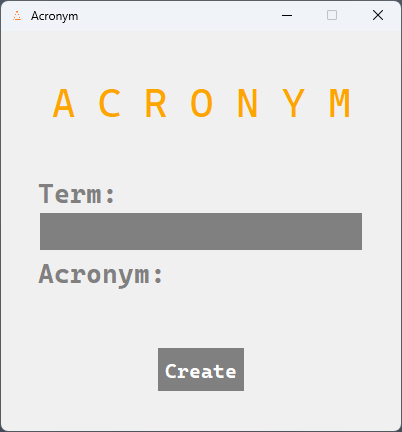

# Acronym Generator

This is a simple Python program that generates an acronym from a user-specified term. The program is built using the `tkinter` module for Python, which provides an easy-to-use graphical user interface.

## How to Use

To use the program, simply enter a term in the input box and click the "Create" button. The program will generate an acronym from the term and display it in the output box.

## Requirements

This program requires Python 3.x and the `tkinter` module, which is included with most Python distributions.

## Installation

To install the program, simply clone the GitHub repository:

git clone https://github.com/<your_username>/acronym-generator.git
Then, navigate to the directory containing the program and run the acronym_generator.py file:

cd acronym-generator
python acronym_generator.py

# License
This program is licensed under the MIT License. See the LICENSE file for more information.

# Output
